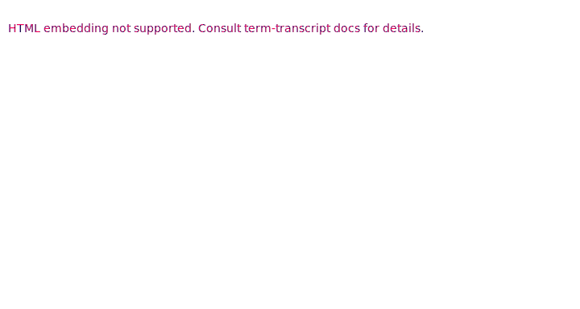

# CLI / REPL for Arithmetic Parser

CLI and REPL for parsing and evaluating arithmetic expressions
that uses [`arithmetic-parser`](../parser) and [`arithmetic-eval`](../eval) internally.
Supports integer, modular, real and complex-valued arithmetic.
Each arithmetic is supplied with all standard functions from the `arithmetic-eval` crate
(`map`, `assert` and so on) and some functions / constants specific to the number type.

## Usage

**Tip.** Run the binary with `--help` flag to find out more details.

### Parsing

Use the `--ast` flag to output the AST of the expression. The AST is output
in the standard Rust debug format.

### Evaluating

Without the `--ast` or `--interactive` flags, the command evaluates
the provided expression in the selected arithmetic.

### REPL

With the `--interactive` / `-i` flag, the command works as REPL, allowing
to iteratively evaluate expressions.

## License

Licensed under either of [Apache License, Version 2.0](LICENSE-APACHE)
or [MIT license](LICENSE-MIT) at your option.

Unless you explicitly state otherwise, any contribution intentionally submitted
for inclusion in `arithmetic-parser-cli` by you, as defined in the Apache-2.0 license,
shall be dual licensed as above, without any additional terms or conditions.
