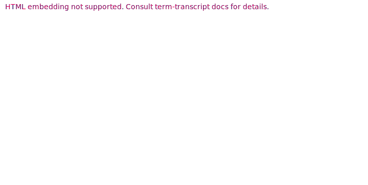
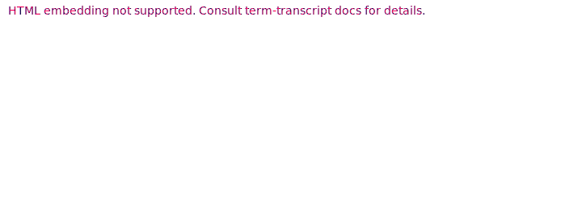

# Snapshots for `arithmetic-parser` CLI

This document lists all snapshots used in E2E testing the `arithmetic-parser` CLI,
with a brief explanation what each snapshot does.

Snapshots for REPL mode (`eval -i` command) are described in [a separate file](repl/README.md).

## Basics

### AST parsing

The `ast` command outputs the parsed AST of the arithmetic block
(of which expression is a partial case). So far, this is just a pretty-printed
`Debug` implementation for the `Block` data type.

### Simple expressions

Expressions / blocks can be evaluated with the `eval` command.

### Functions

Functions are first-class! Beside being called, functions can be used as values
themselves.

### Standard prototypes

Standard prototypes can be accessed via `Array` and `Num` variables. Functions
in these prototypes can be called as using `::` call syntax for brevity,
e.g., `Array::map(..)`.

## AST errors

If parsing an expression / block fails, this is the kind of errors that will be returned,
both for `ast` and `eval` commands.

## Evaluation errors

### Basic evaluation errors

Some errors, such as missing variables, or incorrect function calls, are common
to all supported arithmetics.

### Integer errors

The integer arithmetics are checked by default, meaning that some operations will
lead to an error (rather than a panic or an incorrect result).

### Errors with call trace

If an error occurs within an interpreted function, the call trace will be displayed.

This includes the case when some functions in the call chain are native
(like `fold` in the snapshot above).

## Typing errors

If the `--types` flag is enabled, typing checks will be performed before evaluation.
The report spans are WIP, but in most cases, it is possible to get a general idea
of the error cause.

Unlike with the "raw" evaluation mode, typing errors are *exhaustive*; the typing
logic will attempt to find all errors in the evaluated code.
