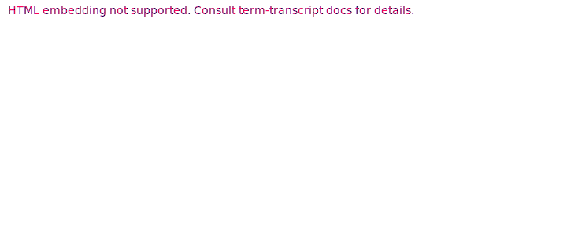

# Snapshots for `arithmetic-parser` REPL

This document lists all snapshots used in E2E testing the `arithmetic-parser` CLI
in the REPL mode, with a brief explanation what each snapshot does.
The REPL mode is activated using the `eval` command with the `--interactive` / `-i` flag. 

Snapshots for the non-interactive mode are described [separately](../README.md).

## Basics

The REPL can be used to evaluate blocks, which includes defining new vars in the global scope.

### Multi-line statements

Like "grown-up" REPLs, `arithmetic-parser` supports multi-line statements
(including multi-line comments).

### Dumping vars

`.dump` command can be used to dump user-defined or all variables from the global scope.

### Typing

If launched with the `--types` flag, the REPL first checks all statements with the type checker.
It is also possible to output variable types with the `.type` command.

### Getting help

`.help` command outputs basic information about REPL usage.

## Errors

### Undefined var

REPL highlights the undefined var. Naturally, it is possible to define a var afterwards
and re-run the command.

### Unknown command

Incorrect commands (a statement starting with `.`) are handled as well.

### Error recovery

If an error occurs during type checks or evaluation, preceding statements still influence
the global scope.
